# ERD MIFABOT

**Status:** Model PostgreSQL setelah migration 001–007  
**Terakhir diperbarui:** 31 Agustus 2026

## Prinsip data

- `billing_definitions` adalah sumber kebenaran untuk tagihan baru; jenis tetap lama hanya jembatan kompatibilitas.
- `billing_definition_rates` menyimpan riwayat nominal global, sedangkan `student_billing_overrides` menyimpan pengecualian nominal per santri.
- `billing_definition_responsibles` menyimpan banyak PJ untuk satu definisi tanpa menghapus histori penugasan.
- `billing_reminder_rules` menyimpan offset reminder otomatis per definisi;
  delivery otomatis dideduplikasi per aturan dan bill.
- `billing_reminder_manual_batches` dan `billing_reminder_deliveries` mencatat
  setiap command manual dan hasil pengirimannya secara terpisah.
- `bills` dan `payments` menyimpan referensi definisi beserta snapshot nama. Nominal bill adalah snapshot ketika bill dibuat.
- `payment_allocations` adalah satu-satunya sumber untuk menghitung pembayaran bill.
- Tunggakan adalah query atas bill yang periodenya berakhir dan masih bersisa, bukan tabel tersendiri.
- Struktur legacy (`jenis_tagihan`, `tariffs`, `admin_assignments`) dipertahankan dan disinkronkan sebagai bridge selama cutover.

## ERD

```mermaid
erDiagram
    ROLES ||--o{ USERS : memiliki
    ROLES ||--o{ ROLE_PERMISSIONS : memberi
    PERMISSIONS ||--o{ ROLE_PERMISSIONS : diatur_dalam

    USERS ||--o{ ADMIN_ASSIGNMENTS : penugasan_legacy
    USERS ||--o{ TARIFFS : tarif_legacy
    USERS ||--o{ BILLING_DEFINITIONS : membuat
    USERS ||--o{ BILLING_DEFINITION_RATES : membuat
    USERS ||--o{ STUDENT_BILLING_OVERRIDES : menerima
    USERS ||--o{ STUDENT_BILLING_OVERRIDES : membuat
    USERS ||--o{ BILLING_DEFINITION_RESPONSIBLES : menjadi_PJ
    USERS ||--o{ BILLING_REMINDER_RULES : mengatur
    USERS ||--o{ BILLING_REMINDER_MANUAL_BATCHES : meminta
    USERS ||--o{ BILLING_REMINDER_DELIVERIES : menerima
    ADMIN_ASSIGNMENTS ||--o{ BILLING_DEFINITION_RESPONSIBLES : bridge_legacy
    TARIFFS ||--o| STUDENT_BILLING_OVERRIDES : bridge_legacy

    BILLING_DEFINITIONS ||--o{ BILLING_DEFINITION_RATES : memiliki_rate
    BILLING_DEFINITIONS ||--o{ STUDENT_BILLING_OVERRIDES : memiliki_override
    BILLING_DEFINITIONS ||--o{ BILLING_DEFINITION_RESPONSIBLES : memiliki_PJ
    BILLING_DEFINITIONS ||--o{ BILLING_REMINDER_RULES : memiliki_aturan_reminder
    BILLING_DEFINITIONS ||--o{ BILLING_REMINDER_MANUAL_BATCHES : memiliki_batch_manual
    BILLING_DEFINITIONS ||--o{ BILLS : sumber
    BILLING_DEFINITIONS ||--o{ PAYMENTS : konteks
    LEGACY_BILLING_DEFINITION_MAPPINGS }o--|| BILLING_DEFINITIONS : memetakan

    USERS ||--o{ BILLS : ditagihkan
    BILLS ||--o{ BILLING_REMINDER_DELIVERIES : diingatkan
    BILLING_REMINDER_RULES ||--o{ BILLING_REMINDER_DELIVERIES : sumber_otomatis
    BILLING_REMINDER_MANUAL_BATCHES ||--o{ BILLING_REMINDER_DELIVERIES : sumber_manual
    BILLS ||--o{ PAYMENTS : bill_diminta
    USERS ||--o{ PAYMENT_CHANNELS : memiliki
    USERS ||--o{ PAYMENTS : wajib_bayar
    USERS ||--o{ PAYMENTS : mengajukan
    USERS ||--o{ PAYMENTS : dirutekan_ke
    USERS ||--o{ PAYMENTS : memverifikasi
    PAYMENT_CHANNELS ||--o{ PAYMENTS : channel_dipilih
    PAYMENTS ||--o{ PAYMENT_ALLOCATIONS : dialokasikan
    BILLS ||--o{ PAYMENT_ALLOCATIONS : menerima
    PAYMENTS ||--o{ PAYMENT_ARREARS_SELECTIONS : memilih
    BILLS ||--o{ PAYMENT_ARREARS_SELECTIONS : dipilih

    USERS ||--o{ NOTIFICATIONS : menerima
    BILLS ||--o{ NOTIFICATIONS : terkait
    PAYMENTS ||--o{ NOTIFICATIONS : terkait
    USERS ||--o{ AUDIT_LOGS : pelaku

    BILLING_DEFINITIONS {
        uuid id PK
        varchar kode UK
        varchar nama UK
        billing_interval interval
        boolean is_active
        uuid created_by FK
    }
    BILLING_DEFINITION_RATES {
        uuid id PK
        uuid billing_definition_id FK
        bigint nominal
        date berlaku_mulai
        date berlaku_sampai
        uuid created_by FK
    }
    STUDENT_BILLING_OVERRIDES {
        uuid id PK
        uuid billing_definition_id FK
        uuid user_id FK
        bigint nominal
        date berlaku_mulai
        date berlaku_sampai
        uuid legacy_tariff_id FK
    }
    BILLING_DEFINITION_RESPONSIBLES {
        uuid id PK
        uuid billing_definition_id FK
        uuid user_id FK
        boolean is_active
        uuid legacy_admin_assignment_id FK
    }
    BILLING_REMINDER_RULES {
        uuid id PK
        uuid billing_definition_id FK
        smallint offset_days
        boolean is_active
        uuid configured_by FK
    }
    BILLING_REMINDER_MANUAL_BATCHES {
        uuid id PK
        uuid billing_definition_id FK
        uuid requested_by FK
        date as_of_date
    }
    BILLING_REMINDER_DELIVERIES {
        uuid id PK
        uuid billing_reminder_rule_id FK
        uuid billing_reminder_manual_batch_id FK
        uuid bill_id FK
        uuid user_id FK
        date scheduled_for
        status_notifikasi status
    }
    LEGACY_BILLING_DEFINITION_MAPPINGS {
        jenis_tagihan jenis_tagihan PK
        uuid billing_definition_id FK
    }
    BILLS {
        uuid id PK
        uuid user_id FK
        uuid billing_definition_id FK
        varchar nama_tagihan_snapshot
        jenis_tagihan jenis_tagihan_legacy
        bigint nominal
        status_tagihan status
    }
    PAYMENTS {
        uuid id PK
        uuid user_id FK
        uuid billing_definition_id FK
        varchar nama_tagihan_snapshot
        jenis_tagihan jenis_tagihan_legacy
        uuid requested_bill_id FK
        uuid payment_channel_id FK
        status_pembayaran status
    }
```



## Entitas tagihan dinamis

| Entitas | Aturan penting |
| --- | --- |
| `billing_definitions` | `kode` unik dan tidak kosong. `nama` unik tanpa membedakan kapital/spasi tepi. `interval` adalah `WEEKLY`, `MONTHLY`, `YEARLY`, atau `CUSTOM`. Status aktif tidak menghapus histori. |
| `billing_definition_rates` | Nominal global positif. Rentang efektif satu definisi tidak boleh tumpang tindih (constraint exclusion). |
| `student_billing_overrides` | Nominal positif khusus user dan definisi. Rentang efektif per pasangan user–definisi tidak boleh tumpang tindih. `legacy_tariff_id` hanya bridge dari tarif lama. |
| `billing_definition_responsibles` | Relasi banyak-ke-banyak definisi–PJ. Satu pasangan hanya boleh satu kali aktif. Trigger menolak PJ aktif atau yang diaktifkan kembali bila bukan `ADMIN` atau `SUPER_ADMIN`. `legacy_admin_assignment_id` hanya bridge penugasan unit lama. |
| `billing_reminder_rules` | Aturan otomatis per definisi. `offset_days` dihitung terhadap jatuh tempo (`H-7 = -7`, `H-0 = 0`, `H+3 = 3`); satu offset aktif hanya sekali per definisi dan rule nonaktif dipertahankan sebagai histori. |
| `billing_reminder_manual_batches` | Satu batch untuk setiap command manual; command berulang membuat batch audit baru. |
| `billing_reminder_deliveries` | Berasal dari tepat satu rule otomatis atau batch manual. Otomatis unik per rule–bill, manual unik per batch–bill; status dan jumlah percobaan mencatat lifecycle pengiriman. |
| `legacy_billing_definition_mappings` | Memetakan setiap nilai enum `jenis_tagihan` lama ke satu definisi seed. Ini bukan tabel konfigurasi tagihan baru. |
| `bills` | Wajib memiliki sumber tagihan: `billing_definition_id` atau `jenis_tagihan` legacy. Trigger mengisi/menjaga definisi dan snapshot nama. Satu user, definisi, dan periode yang sama hanya boleh menghasilkan satu bill serta periodenya tidak boleh tumpang tindih. |
| `payments` | Wajib memiliki sumber tagihan. Untuk bill berjalan, definisi harus cocok dengan bill target; routing user harus menuju channel milik PJ aktif definisi. |

## Entitas legacy dan operasional

| Entitas | Aturan aktual |
| --- | --- |
| `users` | `username` dan `nomor_whatsapp` unik. Nomor disimpan digit internasional tanpa `+`; user bot harus `AKTIF`. |
| `admin_assignments` | Penugasan unit lama (`BENDAHARA`, `PENDIDIKAN`, `KESEJAHTERAAN`) masih ada untuk kompatibilitas dan dapat menyintesis PJ bridge. Bukan sumber routing tagihan dinamis baru. |
| `tariffs` | Tarif per user dan jenis lama; setiap perubahan disinkronkan menjadi override bridge. Tidak dipakai sebagai sumber nominal tagihan dinamis baru. |
| `payment_channels` | Channel aktif dimiliki admin. Metode: `DANA`, `BANK_TRANSFER`, atau `CASH`; rekening wajib untuk metode non-cash. |
| `payment_arrears_selections` | Untuk payment `ARREARS`, setiap bill terpilih harus sama dengan sisa bill saat dipilih. |
| `payment_allocations` | Hanya payment `APPROVED` yang dapat dialokasikan dan alokasi harus sesuai user/definisi tagihan. |
| `notifications` | Mencatat lifecycle notifikasi legacy/umum. Reminder dinamis memakai `billing_reminder_deliveries` untuk lifecycle dan audit pengiriman. |
| `audit_logs` | Tabel tersedia, tetapi runtime belum menulis audit log. |

## Nilai enum

| Domain | Nilai |
| --- | --- |
| `billing_interval` | `WEEKLY`, `MONTHLY`, `YEARLY`, `CUSTOM` |
| `status_user` | `AKTIF`, `NONAKTIF` |
| `jenis_kelamin` | `L`, `P` |
| `jenis_tagihan` (legacy) | `BULANAN`, `TAHUNAN`, `PENDIDIKAN`, `KESEJAHTERAAN` |
| `status_tagihan` | `BELUM_BAYAR`, `CICIL`, `LUNAS` |
| `status_pembayaran` | `PENDING`, `APPROVED`, `REJECTED`, `CANCELLED` |
| `ruang_lingkup_pembayaran` | `CURRENT_BILL`, `ARREARS` |
| `submission_type_pembayaran` | `USER_SELF`, `ADMIN_SELF`, `ADMIN_FOR_USER` |
| `jenis_metode_pembayaran` | `DANA`, `BANK_TRANSFER`, `CASH` |
| `status_notifikasi` | `PENDING`, `SENT`, `FAILED` |

## Hubungan pembayaran

| Scope | Representasi | Aturan |
| --- | --- | --- |
| Bill berjalan | `CURRENT_BILL` dan `requested_bill_id` terisi | Bill harus milik user, memiliki definisi yang sama, mencakup tanggal pengajuan, dan nominal tidak melebihi sisa. |
| Tunggakan | `ARREARS` dan `requested_bill_id` kosong | Pilihan disimpan di `payment_arrears_selections`; masing-masing harus dibayar penuh. |

Status bill diperbarui dari total `payment_allocations`:

```text
0                    -> BELUM_BAYAR
0 < total < nominal  -> CICIL
total = nominal      -> LUNAS
```

Lihat [ADR-003](docs/architecture/003-tagihan-dinamis.md) untuk keputusan produk dan batasan cutover.
